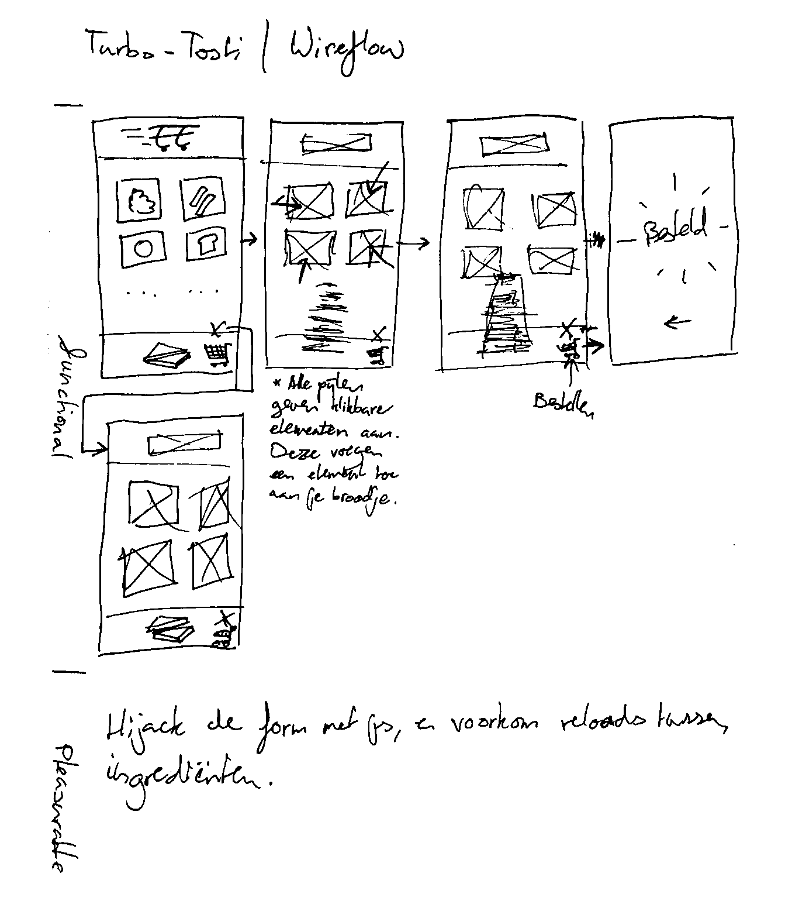

# Browser Technologies @cmda-minor-web 1819
## Wireflow

Ik hev de app zo gemaakt dat je alleen een werkende "HTML5 browser" nodig hebt.

Met CSS wordt de app mooi gestyleerd. Hierbij heb ik rekening gehouden met de ondersteuning van features m.b.v. [caniuse.com](caniuse.com).

Om de app wat lekkerder en sneller te laten werken, heb ik javascript ingezet om de oorspronkelijke werking tegen te houden, en alle request via javascript af te werken. Zo voorkom je bijvoorbeeld een page-reload per toegevoegd ingrediënt. Mocht de browser geen javascript onderstaunen, zal de app dus gebwoon naar behoren werken.

## Beschrijving van de Browser Technologies
### Promises
Ik gebruik bluebird promises. Zo hoef ik niet te polyfillen als native promises niet bestaan. De redend at ik uberhaupt promises gebruik is omdat de API super intuitief is, en weinig werk vereist. Als ik zelf een alternatief had willen programmeren had ik veel meer tijd nodig.

### Fetch
Ik gebruik een fallback voor fetch, als `window.fetch` niet bestaat. Zo kan ik die API gebruiken, ipv. een _ingecompliwikkelde_ `XMLHttpRequest`-constructie.

## Feature-ondersteuning
Alle browsers vanaf netscape 7 en Internet explorer 6 zouden moeten werken ([volgens de ontiwkkelaars van bluebird](https://stackoverflow.com/a/37445310)). De rest van de javascript is met es3 geprogrammeerd, en [getest met es-check](https://github.com/dollarshaveclub/es-check). Dit zou moeten betekenen dat alles werkt als ECMAscript 3, en dus in bijna alle browsers ter wereld zou moeten werken.

## Onderzochte accessibility-issues
### Kleur
Ik heb via Lighthouse van chrome de accessibility getest, en deze tool vertelde mij dat het contrast van text op achtergrond goed was.

Ook volgens [color.review](https://color.review/) is het contrast op alle elementen goed.

### "Tabbaarheid" 🤔???
Ik heb mijn best gedaan om alle elementen correct in HTML te zetten, zodat ze zonder enige moeite navigeerbaar zijn met het toetsenbord. Voor zover mijn tests zijn gegaan (best ver), heb ik geen probleem met de "tabbaarheid" gevonden.

### Screenreader-friendly
Ik heb mijn scherm uitgezet, een screen-reader aangezet, en een tosti gemaakt. Dat ging goed. Volgens mij is dat een goede indicatie dat het lekker werkt met screen-readers.

Ik heb onzichtbare accessibility-elementen toegevoegd om screenreaders te helpen met het beschijven van formulieren etc.